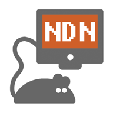

# ndnMouse

## Documentation

### Overview

It's a secure control interface for a PC over named-data-networking (NDN), using a mobile device! It also has UDP support.

### Current Features

* Mouse control: movement, left click, right click, tap-to-click
* Mouse sensitivity settings
* UDP and NDN support

### Planned Features

* NDN Security: data encryption and packet signature validation
* UDP Security: data encryption only
* Rudimentary keyboard support (for slideshow control?)

### Supported Platforms

##### Severs/Producers (phone): 
* Any mostly-modern Android phone

##### Clients/Consumers (PC):
* Any Linux distribution that can run NFD and Python3 (tested on Ubuntu 16)
* OSX
* Windows (UDP support only)

## How to Use

### Dependencies
* Python3 (PC)
* PyAutoGUI (PC)
* NFD (PC and Android)

### Install

1. Install NFD on your [Android phone](https://play.google.com/store/apps/details?id=net.named_data.nfd) and the [PC](http://named-data.net/doc/NFD/current/INSTALL.html) on which you want to control the mouse.
1. Compile and install the app using Android Studio on your Android phone.
1. On your PC, install [Python3](https://www.python.org/downloads/) and [PyAutoGUI](https://pyautogui.readthedocs.io/en/latest/install.html)

### Running

1. Make sure NFD is started on both your phone (the server/producer) and your PC (the client/consumer). Use the NFD app to start it on Android. On PC, use `nfd-start`.
1. On your phone, start the server.
1. On your PC, execute one of the Python scripts in the [pc_client](./pc_client) directory (except the TCP one, which isn't currently supported).
1. Control :mouse::exclamation:

## License
TBD